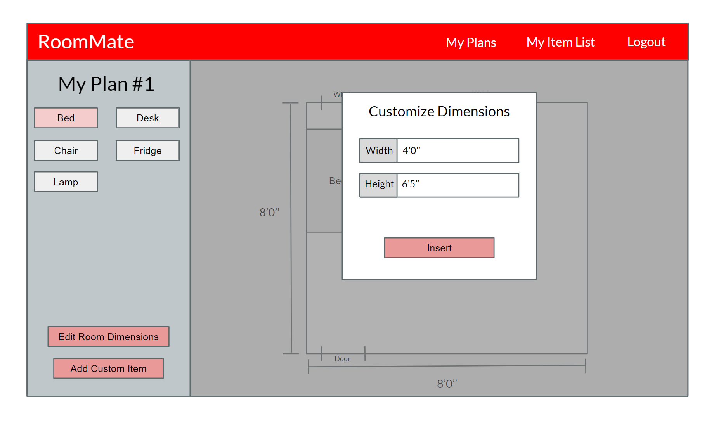

# Wireframes and descriptions

This figure depicts the page a user would see when editing a canavs

This figure depicts the popup that appears when a user is adding a preset item to the canvas

This figure depicts the popu-p that appears when a user views their "to-get" list

