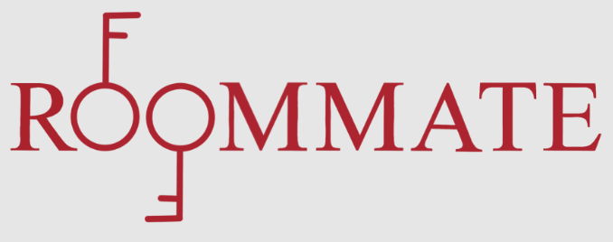

# Welcome to RoomMate

## About

RoomMate is a web-application project that serves as a utility for RPI students to customize the layout of their dorm room. Users will have the flexibility to collaboratively use a drag and drop functionality to arrange preset furniture items on the canvas.

Visit Our Page: https://github.com/abagramian/RoomMate

Team Members: Alexis, Jeffrey, Elise, Donna, Christy

## Want to Contribute?

Public Forum for comments/suggestions: https://forms.gle/JukdCZpSVd6ucQxm9

Please refer to this page for Contribution guidelines: https://github.com/abagramian/RoomMate/blob/main/CONTRIBUTING.md
